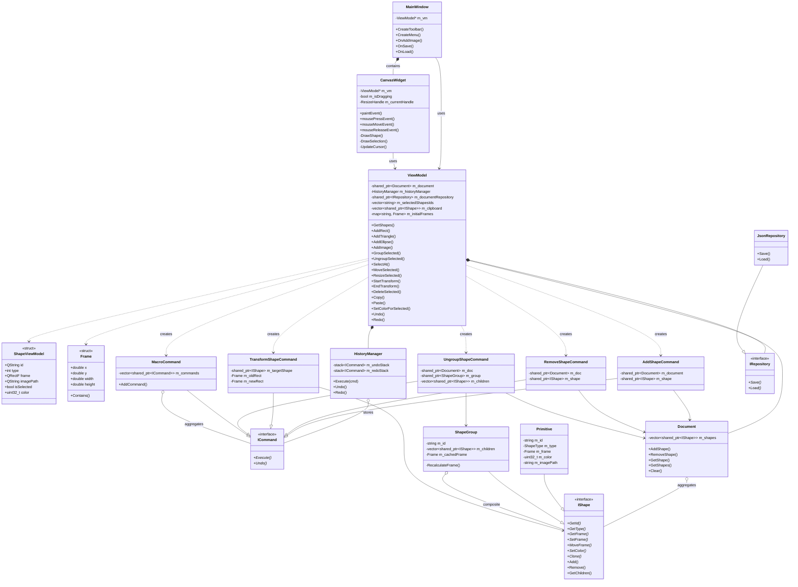

```mermaid
classDiagram
    class MainWindow {
        -ViewModel* m_vm
        +CreateToolbar()
        +CreateMenu()
        +OnAddImage()
        +OnSave()
        +OnLoad()
    }

    class CanvasWidget {
        -ViewModel* m_vm
        -bool m_isDragging
        -ResizeHandle m_currentHandle
        +paintEvent()
        +mousePressEvent()
        +mouseMoveEvent()
        +mouseReleaseEvent()
        -DrawShape()
        -DrawSelection()
        -UpdateCursor()
    }

    MainWindow *-- CanvasWidget: contains
    MainWindow --> ViewModel: uses
    CanvasWidget --> ViewModel: uses

    class ViewModel {
        -shared_ptr~Document~ m_document
        -HistoryManager m_historyManager
        -shared_ptr~IRepository~ m_documentRepository
        -vector~string~ m_selectedShapesIds
        -vector~shared_ptr~IShape~~ m_clipboard
        -map~string, Frame~ m_initialFrames
        +GetShapes()
        +AddRect()
        +AddTriangle()
        +AddEllipse()
        +AddImage()
        +GroupSelected()
        +UngroupSelected()
        +SelectAt()
        +MoveSelected()
        +ResizeSelected()
        +StartTransform()
        +EndTransform()
        +DeleteSelected()
        +Copy()
        +Paste()
        +SetColorForSelected()
        +Undo()
        +Redo()
    }

    class ShapeViewModel {
        <<struct>>
        +QString id
        +int type
        +QRectF frame
        +QString imagePath
        +bool isSelected
        +uint32_t color
    }

    ViewModel ..> ShapeViewModel
    ViewModel ..> Frame

    class HistoryManager {
        -stack~ICommand~ m_undoStack
        -stack~ICommand~ m_redoStack
        +Execute(cmd)
        +Undo()
        +Redo()
    }

    class ICommand {
        <<interface>>
        +Execute()*
        +Undo()*
    }

    class AddShapeCommand {
        -shared_ptr~Document~ m_document
        -shared_ptr~IShape~ m_shape
    }

    class RemoveShapeCommand {
        -shared_ptr~Document~ m_doc
        -shared_ptr~IShape~ m_shape
    }

    class TransformShapeCommand {
        -shared_ptr~IShape~ m_targetShape
        -Frame m_oldRect
        -Frame m_newRect
    }

    class UngroupShapeCommand {
        -shared_ptr~Document~ m_doc
        -shared_ptr~ShapeGroup~ m_group
        -vector~shared_ptr~IShape~~ m_children
    }

    class MacroCommand {
        -vector~shared_ptr~ICommand~~ m_commands
        +AddCommand()
    }

    ViewModel *-- HistoryManager
    ViewModel ..> AddShapeCommand: creates
    ViewModel ..> RemoveShapeCommand: creates
    ViewModel ..> TransformShapeCommand: creates
    ViewModel ..> UngroupShapeCommand: creates
    ViewModel ..> MacroCommand: creates
    HistoryManager o-- ICommand: stores
    AddShapeCommand --|> ICommand
    RemoveShapeCommand --|> ICommand
    TransformShapeCommand --|> ICommand
    UngroupShapeCommand --|> ICommand
    MacroCommand --|> ICommand
    MacroCommand o-- ICommand: aggregates

    class Document {
        -vector~shared_ptr~IShape~~ m_shapes
        +AddShape()
        +RemoveShape()
        +GetShape()
        +GetShapes()
        +Clear()
    }

    class IShape {
        <<interface>>
        +GetId()*
        +GetType()*
        +GetFrame()*
        +SetFrame()*
        +MoveFrame()*
        +SetColor()*
        +Clone()*
        +Add()
        +Remove()
        +GetChildren()
    }

    class Primitive {
        -string m_id
        -ShapeType m_type
        -Frame m_frame
        -uint32_t m_color
        -string m_imagePath
    }

    class ShapeGroup {
        -string m_id
        -vector~shared_ptr~IShape~~ m_children
        -Frame m_cachedFrame
        -RecalculateFrame()
    }

    class Frame {
        <<struct>>
        +double x
        +double y
        +double width
        +double height
        +Contains()
    }

    class IRepository {
        <<interface>>
        +Save()*
        +Load()*
    }

    class JsonRepository {
        +Save()
        +Load()
    }

    Document o-- IShape: aggregates
    Primitive --|> IShape
    ShapeGroup --|> IShape
    ShapeGroup o-- IShape: composite
    ViewModel *-- Document
    ViewModel *-- IRepository
    JsonRepository --|> IRepository
    AddShapeCommand --> Document
    RemoveShapeCommand --> Document
    UngroupShapeCommand --> Document
    UngroupShapeCommand --> ShapeGroup
    TransformShapeCommand --> IShape
```