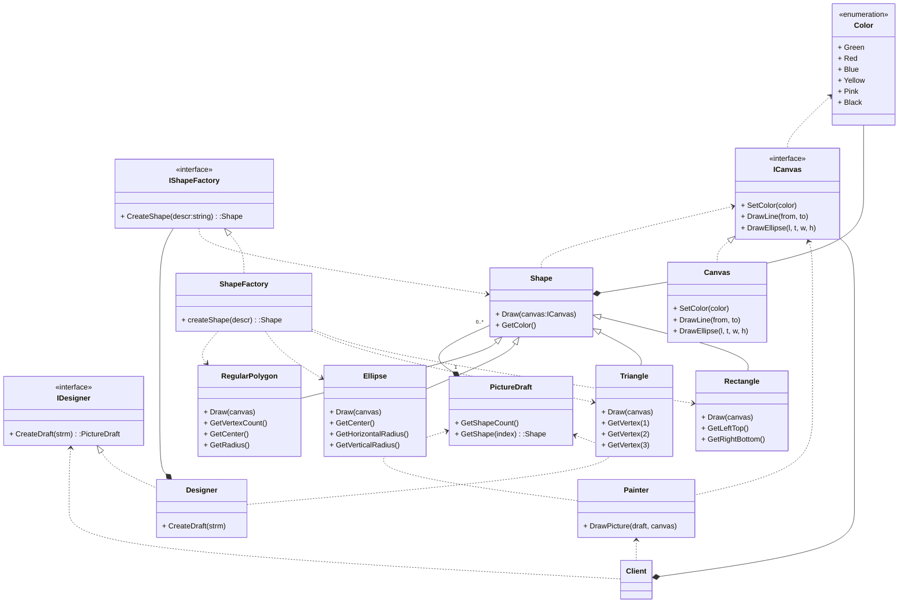

```mermaid
classDiagram
    class IShapeFactory {
        <<interface>>
        + CreateShape(descr:string):Shape
    }

    class IDesigner {
        <<interface>>
        + CreateDraft(strm):PictureDraft
    }

    class Designer {
        + CreateDraft(strm)
    }

    class PictureDraft {
        + GetShapeCount()
        + GetShape(index):Shape
    }

    class Shape {
        + Draw(canvas:ICanvas)
        + GetColor()
    }

    class Rectangle {
        + Draw(canvas)
        + GetLeftTop()
        + GetRightBottom()
    }

    class Triangle {
        + Draw(canvas)
        + GetVertex(1)
        + GetVertex(2)
        + GetVertex(3)
    }

    class Ellipse {
        + Draw(canvas)
        + GetCenter()
        + GetHorizontalRadius()
        + GetVerticalRadius()
    }

    class RegularPolygon {
        + Draw(canvas)
        + GetVertexCount()
        + GetCenter()
        + GetRadius()
    }

    class Canvas {
        + SetColor(color)
        + DrawLine(from, to)
        + DrawEllipse(l, t, w, h)
    }

    class ICanvas {
        <<interface>>
        + SetColor(color)
        + DrawLine(from, to)
        + DrawEllipse(l, t, w, h)
    }

    class Client

    class Painter {
        + DrawPicture(draft, canvas)
    }

    class Color {
        <<enumeration>>
        + Green
        + Red
        + Blue
        + Yellow
        + Pink
        + Black
    }

    class ShapeFactory {
        + createShape(descr):Shape
    }

    IShapeFactory <|.. ShapeFactory 
    ShapeFactory ..> Rectangle
    ShapeFactory ..> Triangle
    ShapeFactory ..> Ellipse
    ShapeFactory ..> RegularPolygon
    IShapeFactory ..> Shape
    Shape <|-- Rectangle 
    Shape <|-- Triangle
    Shape <|-- Ellipse
    Shape <|-- RegularPolygon
    Color --* Shape 
    Shape "0..*" --* "1" PictureDraft
    PictureDraft <.. Designer 
    PictureDraft <.. Painter
    IShapeFactory --* Designer
    IDesigner <|.. Designer
    ICanvas --* Client
    Color <.. ICanvas
    IDesigner <.. Client 
    Painter <.. Client
    ICanvas <.. Painter
    ICanvas <|.. Canvas
    ICanvas <.. Shape 

```