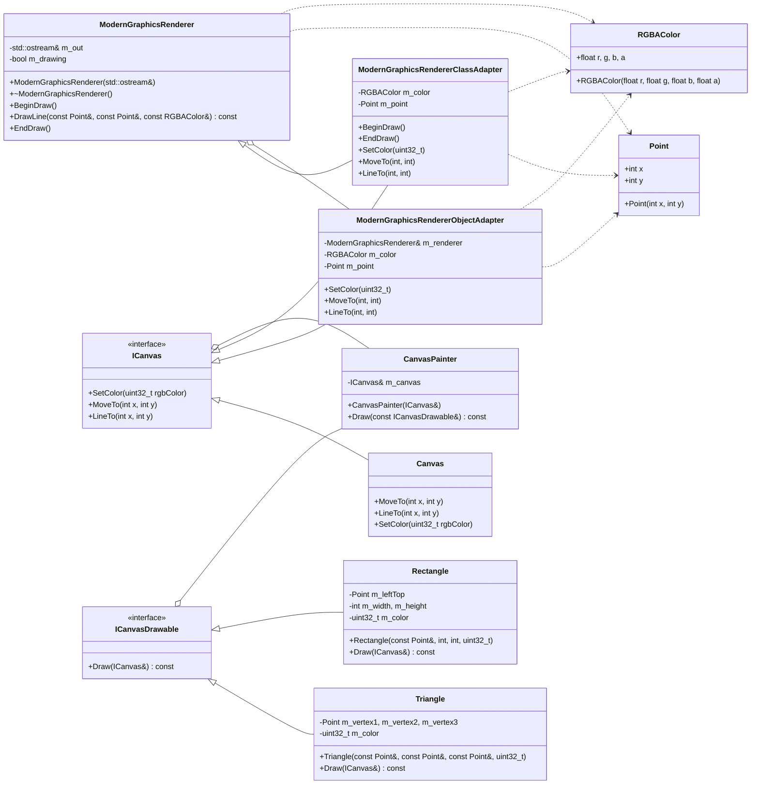

```mermaid
classDiagram
    direction LR

    class ICanvasDrawable {
        <<interface>>
        +Draw(ICanvas&) const
    }

    class ICanvas {
        <<interface>>
        +SetColor(uint32_t rgbColor)
        +MoveTo(int x, int y)
        +LineTo(int x, int y)
    }

    class Canvas {
        +MoveTo(int x, int y)
        +LineTo(int x, int y)
        +SetColor(uint32_t rgbColor)
    }

    ICanvas <|-- Canvas

    class ModernGraphicsRenderer {
        -std::ostream& m_out
        -bool m_drawing
        +ModernGraphicsRenderer(std::ostream&)
        +~ModernGraphicsRenderer()
        +BeginDraw()
        +DrawLine(const Point&, const Point&, const RGBAColor&) const
        +EndDraw()
    }

    class Point {
        +int x
        +int y
        +Point(int x, int y)
    }

    class RGBAColor {
        +float r, g, b, a
        +RGBAColor(float r, float g, float b, float a)
    }

    class ModernGraphicsRendererObjectAdapter {
        -ModernGraphicsRenderer& m_renderer
        -RGBAColor m_color
        -Point m_point
        +SetColor(uint32_t)
        +MoveTo(int, int)
        +LineTo(int, int)
    }

    class ModernGraphicsRendererClassAdapter {
        -RGBAColor m_color
        -Point m_point
        +BeginDraw()
        +EndDraw()
        +SetColor(uint32_t)
        +MoveTo(int, int)
        +LineTo(int, int)
    }

    ICanvas <|-- ModernGraphicsRendererObjectAdapter
    ICanvas <|-- ModernGraphicsRendererClassAdapter
    ModernGraphicsRenderer <|-- ModernGraphicsRendererClassAdapter
    ModernGraphicsRenderer o-- ModernGraphicsRendererObjectAdapter

    class Triangle {
        -Point m_vertex1, m_vertex2, m_vertex3
        -uint32_t m_color
        +Triangle(const Point&, const Point&, const Point&, uint32_t)
        +Draw(ICanvas&) const
    }

    class Rectangle {
        -Point m_leftTop
        -int m_width, m_height
        -uint32_t m_color
        +Rectangle(const Point&, int, int, uint32_t)
        +Draw(ICanvas&) const
    }

    class CanvasPainter {
        -ICanvas& m_canvas
        +CanvasPainter(ICanvas&)
        +Draw(const ICanvasDrawable&) const
    }

    ICanvasDrawable <|-- Triangle
    ICanvasDrawable <|-- Rectangle
    ICanvas o-- CanvasPainter
    ICanvasDrawable o-- CanvasPainter

    ModernGraphicsRendererObjectAdapter ..> Point 
    ModernGraphicsRendererObjectAdapter ..> RGBAColor 
    ModernGraphicsRendererClassAdapter ..> Point 
    ModernGraphicsRendererClassAdapter ..> RGBAColor
    ModernGraphicsRenderer ..> Point
    ModernGraphicsRenderer ..> RGBAColor 
```